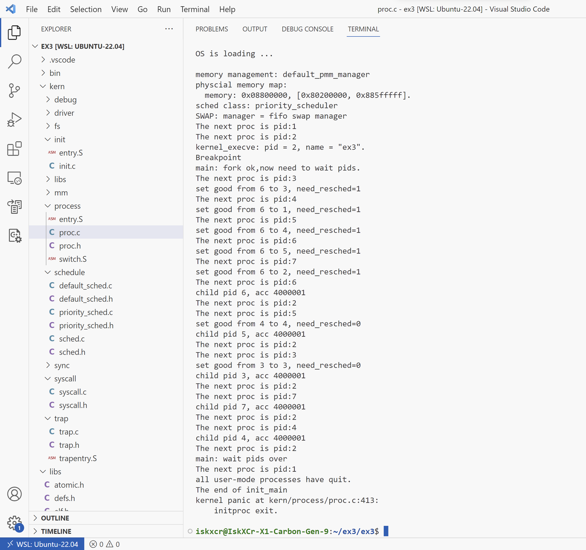

# CS334-Operating-System-H Assignment 4

**Result:**




Design idea:

**We implement the priority scheduling in a separate file named `priority_sched.c`**.

- Use `lib_skew_heap` to maintain a skew heap. Since the skew heap only pops the smallest item, each time the item with largest good (if they have the same good value then the first enqueued one is picked) is popped out (using a custom comparator).

  We assign each process, when entering the queue, an **enter_time** for it so that for items with the same value, the FIFO behavior is guaranteed. In reality, an **enter_time** entry should be associated with the actual time the machine is running at (epoch time presumably). 

  ```C
  struct proc_struct {
  	/* ... */
      
      //for week11 exercise after class
      uint32_t labschedule_priority;    
      uint32_t labschedule_good;
      skew_heap_entry_t proc_pool_entry;
      size_t proc_pool_entry_time;                // the time the process is appended to the process pool. If 0, then the process hasn't been enqueued.
  };
  ```

  

  We **do not** consider the case in which the number of processes exceeds upper limit of `size_t` type enters the queue. In such case, the skew heap needs to be modified significantly (which also breaks the conciseness of the ucore design). To solve the corner case we haven't considered, in a trivial way, we can use a single queue in which each time we pick the process with largest good value in $O(n)$ time, by scanning through the entire queue.

  ```C
  /* kern/schedule/priority_sched.h */
  #ifndef __KERN_SCHEDULE_SCHED_PRIORITY_H__
  #define __KERN_SCHEDULE_SCHED_PRIORITY_H__
  
  #include <sched.h>
  
  extern struct sched_class priority_sched_class;
  
  #endif /* !__KERN_SCHEDULE_SCHED_PRIORITY_H__ */
  
  /* kern/schedule/priority_sched.c */
  #include <defs.h>
  #include <proc.h>
  #include <assert.h>
  #include <skew_heap.h>
  #include <priority_sched.h>
  
  static int
  compare_proc(skew_heap_entry_t *_lhs, skew_heap_entry_t *_rhs) {
      struct proc_struct *lhs = she2proc(_lhs, proc_pool_entry);
      struct proc_struct *rhs = she2proc(_rhs, proc_pool_entry);
      if (lhs->labschedule_good > rhs->labschedule_good) {
          return -1;
      }
      else if (lhs->labschedule_good == rhs->labschedule_good) {
          if (lhs->proc_pool_entry_time < rhs->proc_pool_entry_time) {
              return -1;
          }
          else if (lhs->proc_pool_entry_time == rhs->proc_pool_entry_time) {
              return 0;
          }
          else {
              return 1;
          }
      }
      else {
          return 1;
      }
  }
  
  static void
  priority_init(struct run_queue *rq) {
      rq->labschedule_run_pool = NULL;
      rq->proc_num = 0;
  }
  
  static size_t entry_time = 0;
  
  static void
  priority_enqueue(struct run_queue *rq, struct proc_struct *proc) {
      proc->proc_pool_entry_time = ++entry_time;
      rq->labschedule_run_pool = skew_heap_insert(rq->labschedule_run_pool, &(proc->proc_pool_entry), (compare_f)compare_proc);
      if (proc->time_slice == 0 || proc->time_slice > rq->max_time_slice) {
          proc->time_slice = rq->max_time_slice;
      }
      proc->rq = rq;
      rq->proc_num ++;
  }
  
  static void
  priority_dequeue(struct run_queue *rq, struct proc_struct *proc) {
      assert((proc->proc_pool_entry_time != 0) && proc->rq == rq);
      proc->proc_pool_entry_time = 0;
      rq->labschedule_run_pool = skew_heap_remove(rq->labschedule_run_pool, &(proc->proc_pool_entry), (compare_f)compare_proc);
      rq->proc_num --;
  }
  
  static struct proc_struct *
  priority_pick_next(struct run_queue *rq) {
      if (rq->labschedule_run_pool != NULL)
          return she2proc(rq->labschedule_run_pool, proc_pool_entry);
      return NULL;
  }
  
  static void
  priority_proc_tick(struct run_queue *rq, struct proc_struct *proc) {
      if (proc->time_slice > 0) {
          proc->time_slice --;
      }
      if (proc->time_slice == 0) {
          proc->need_resched = 1;
      }
  }
  
  struct sched_class priority_sched_class = {
      .name = "priority_scheduler",
      .init = priority_init,
      .enqueue = priority_enqueue,
      .dequeue = priority_dequeue,
      .pick_next = priority_pick_next,
      .proc_tick = priority_proc_tick,
  };
  
  /* kern/schedule/sched.c */
  void
  sched_init(void) {
      list_init(&timer_list);
  
      sched_class = &priority_sched_class; // match the priority sched class
  
      rq = &__rq;
      rq->max_time_slice = MAX_TIME_SLICE;
      sched_class->init(rq);
  
      cprintf("sched class: %s\n", sched_class->name);
  }
  ```

- We append an entry in `ulib.h`, `ulib.c` that calls `sys_labschedule_set_priority(uint64_t arg[])`.

  ```C
  /* kern/syscall/syscall.c */
  static int
  sys_labschedule_set_priority(uint64_t arg[]) {
      labschedule_set_priority((uint32_t)arg[0]);
      return 0;
  }
  
  /* kern/process/proc.c */
  void labschedule_set_priority(uint32_t priority)
  {
      uint32_t prev = current->labschedule_good;
      current->labschedule_good = priority;
      if (priority < prev)
          current->need_resched = 1;
      cprintf("set good from %d to %d, need_resched=%d\n", prev, priority, current->need_resched);
  }
  
  /* user/libs/ulib.c */
  void set_good(uint32_t priority) {
      sys_labschedule_set_priority(priority);
  }
  
  /* user/libs/syscall.c */
  int
  sys_labschedule_set_priority(uint32_t priority) {
      return syscall(SYS_labschedule_set_priority, priority);
  }
  ```

  